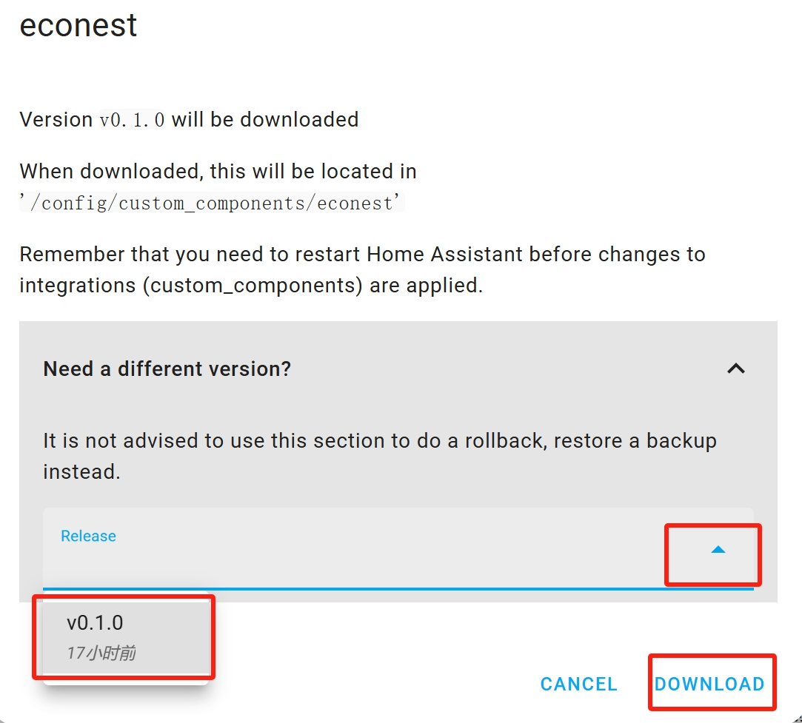

# econest
## econest device energy data display

## Installation with HACS

[](https://github.com/hacs/integration)

The simplest way to install this integration is with the Home Assistant Community Store (HACS). This is not (yet) part of the default store and will need to be added as a custom repository.

Setting up a custom repository is done by:

1. Go into HACS from the side bar.
2. Click the 3-dot menu in the top right and select `Custom repositories`
3. In the UI that opens, copy and paste the [url for this github repo](https://github.com/econest-energy/econest) into the `repository` field.
4. Set the Type to `Integration`, Click the `Add` button.
5. HACS Add Integration > search for ```econest```，Click to download.
6. Restart the HomeAssistant platform, add automatically discovered devices or manually add devices



